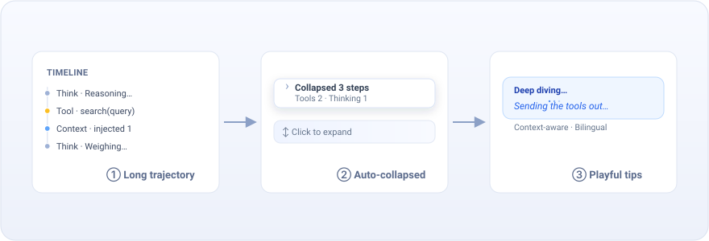
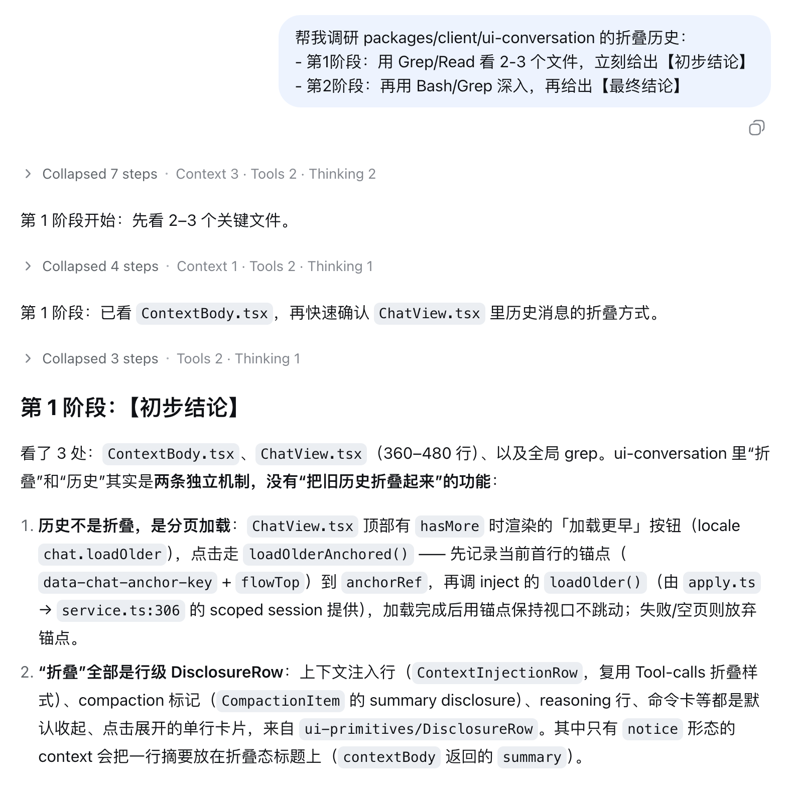
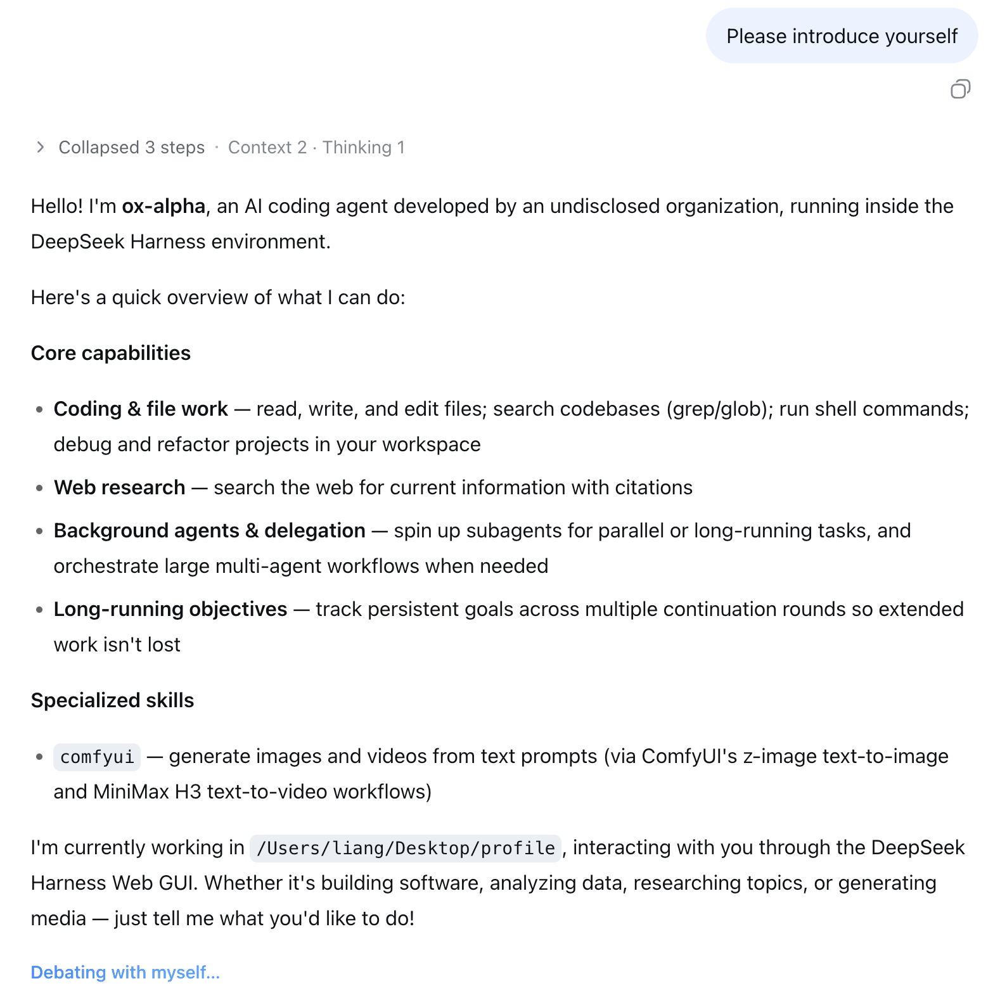

<div align="center">



# dsh-timeline-enhance

**Chat timeline auto-collapse + Deep diving playful tips · A DeepSeek Harness Web UI plugin**

[](LICENSE)


**Install**

```sh
dsh plugin --profile web add github:lianginx/dsh-timeline-enhance
```

English · [简体中文](./README.zh.md)

</div>

---

A tiny plugin for a big readability win.

- **After the answer, it tidies up** — the 20+ intermediate steps collapse into one line. Need details? One click to expand.
- **While you wait, it keeps you company** — instead of a frozen `Deep diving...`, a small, friendly hint shows what the agent is actually doing.

You can turn either off in `Settings → Timeline Enhance` — each has a live preview.

## Screenshots

| Auto-collapse                                                                       | Playful tips                                                                        |
| ----------------------------------------------------------------------------------- | ----------------------------------------------------------------------------------- |
|   |        |
| Collapse 20+ noisy steps into `▸ Collapsed 3 steps · Tools 2`. One click to expand. | Context-aware fun hints like `Sending the tools out for a walk…` while Deep diving. |

## License

[MIT](LICENSE)
