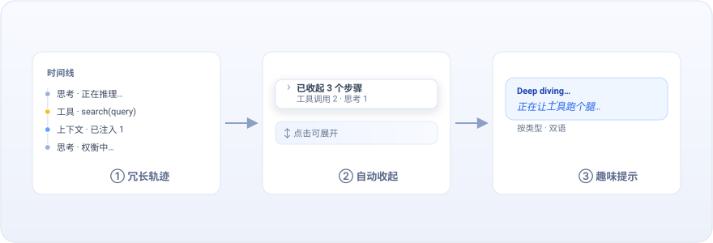

<div align="center">



# dsh-timeline-enhance

**聊天时间线自动收起 + Deep diving 趣味提示 · DeepSeek Harness Web UI 插件**

[](LICENSE)


**一行安装**

```sh
dsh plugin --profile web add github:lianginx/dsh-timeline-enhance
```

[English](README.md) · 简体中文

</div>

---

为超长 Agent 轨迹而生的轻量增强。

- **答完即收起** — 60 行日志 → 1 行总结，想看再展开。
- **等待不无聊** — 告别卡住的 `Deep diving...`，看一句符合当前状态的轻量提示。

两项均可在 `设置 → 时间线增强` 一键开关，均带实时预览。

## 截图

| 自动收起                                                                  | 趣味提示                                                              |
| ------------------------------------------------------------------------- | --------------------------------------------------------------------- |
|  |  |
| 一键将 20+ 步骤收起为 `▸ 已收起 3 个步骤`，点一下展开。                   | 根据当前类型随机显示“正在让工具跑个腿…”等轻量提示。                   |

## 许可证

[MIT](LICENSE)
